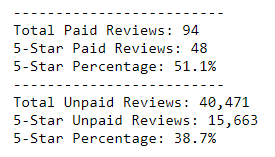

# Amazon_Vine_Analysis
The goal of this analysis is to determine if Amazon's Vine system, which pays for select items for select reviewers when the items are reviewed, skews the reviews of the selected items.

## Project Overview
Using Amazon Web Services, pgAdmin, Google Colab, and Jupyter Notebook, isolate and analyze various reviews of Amazon video games.

## Results

Restricting the pool of reviews to those with at least 20 votes and at least 50% of the votes deeming the review "helpful," the sollofinw results were found:

Reviews in the Vine system (Paid) make up a small minority (94) of total reviews. Of those 94 reviews, 48, fully 51.1%, were 5-star ratings. Conversely, 40,471 unpaid reviews met the criteria for consideration. Of those, only 15,663, or 38.7%, were 5-Star ratings. Given this information, the Vine system appears to have had an positive bias on ratings. Additional analysis could include a full count of all rating scores, as it's possible that the Vine system simply had a polarizing effect on reviews scores, and also had a higher percentage of 1-Star reviews, but that cannot be determined by the current analysis.